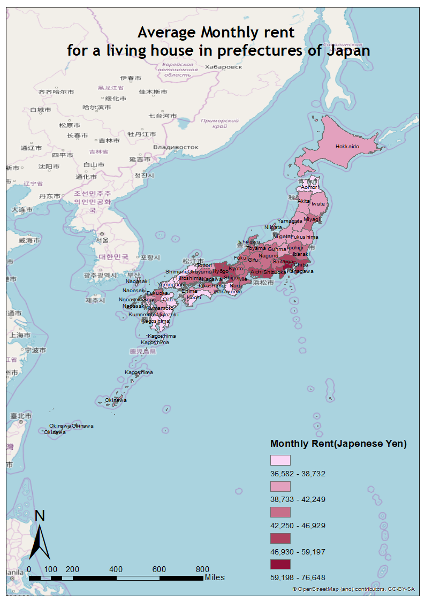
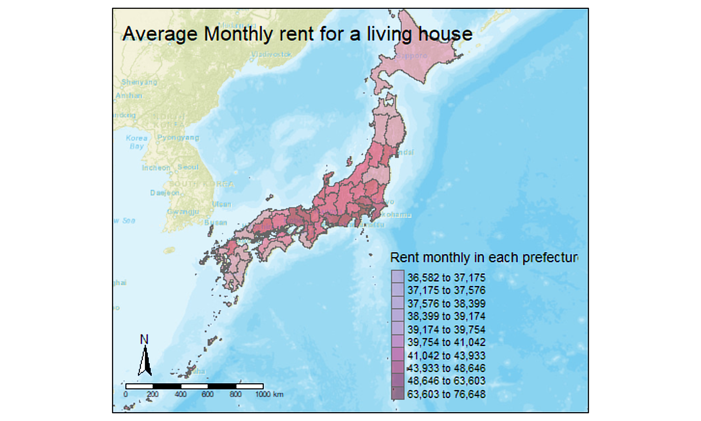

To create a clear, well-analysed and nicely presented map, Graphical User interface(GUI) software i.e. ArcGIS or code-based software i.e. R may be used. 

In general, GUI software allows user to navigate from the visual indicators in the interface such as icons. This is a more beginners friendly mechanism where no prerequisite is required to carried out basic functions. Whereas coding software requires knowledge to the command line, as its accuracy and precision are the key for the machine to operate. Without the need of user-friendly interface, code-based programme has advantages on the flexibility and speed of processing a large dataset.


###Procedure of cartography
The following maps are drawn using the same piece of data, one created from ArcGIS and one from R, with similar workflow as listed:

1.	Find and read the boundary and attribute data of the area of investigation – in this case, Japan with boarder lines between the 47 prefectures
2.	Join the boundary and attribute data
3.	Draw map by selecting the variable of investigation
4.	Adjust the colour and layout of the map by inserting compass, legends, scales and a base map.

####Map create using ArcGIS

#

####Map create using R
#


### Format of the data and Data manipulation
ArcMap accepts shapefile for the boundary data and excel file(.xls) for attributed data.

Whereas for R, boundary data in form of shapefile may be read into a simple feature object, and file in forms of GeoJson file may be read into spatial Polygons Data Frames. 
The excel file can be read by R with the help of the R package “xlsx”. However, the autoformatting features of xls could disarrange the data. Hence, the form of csv, a plain text format, is used. 

```{r}
#read the csv and shp file into R 
JPdataOSK <- read.csv("JPdata.csv")

JPdataSF<- read_shape("C:\\Users\\demi8\\OneDrive\\桌面\\Postgrad\\CASA0005 GIS\\Assignment1\\JPN_adm\\JPN_adm1.shp", as.sf = TRUE)
```


```{r}
#Packages required in R to perfrom map drawing
library(imager)
library(maptools)
library(RColorBrewer)
library(classInt)
library(OpenStreetMap)
library(sp)
library(rgeos)
library(tmap)
library(tmaptools)
library(sf)
library(rgdal)
library(geojsonio)
library(ggplot2)
```


###Joining Attribute data
Various methods may be used in ArcMap, including using pre-set tool from Arc Toolbox, or model builder. These methods are well instructed with clear input and targeted section to ensure correct columns are matched. However, this join is temporary on the original layer and a copy of the layer is needed to make this dataset permanent.

For R, the following code is used for the joining the attribute data, and a new dataset is created without changing the original data set.:


```{r}
#rename the column to ensure it can be found for matching
JPdataOSK<- edit(JPdataOSK)

#Join attribute data
JPdataMap <- append_data(JPdataSF,JPdataOSK, key.shp = "ID_1", key.data = "ID_prefecture", ignore.duplicates = TRUE)


```


###Presenting the Map
In ArcMap, the map is shown when data are imported, ArcCatalogue even allows to preview the shapefile before selection. After picking the area of investigation, appropriate colours are used, in this case as the data are continuous, same colour is used with different gradient to show the comparison clearly. ArcScene may be used to create a 3-Dimensional map. The layout can be set may dragging the items directly on the map, making changes easier.

The visualisation packages tmap and ggmap are used in R which simplifies the process of cartography, where an interactive map can even be produced under the tmap mode. However, users must be familiar with the command, as the style, layout, font size and legend are all inserted by codes. They must imagine the final product and adjust the code each time while changing the layout.

```{r}
#Making maps by chosing the palette
tmap_mode("plot")
library(shinyjs)
tmaptools::palette_explorer()

#Adding basemaps by downloading from Open Street Map
JPdata_osm <- read_osm(JPdataMap, type = "esri", zoom = NULL)

qtm(JPdata_osm) +
tm_shape(JPdataMap) +
tm_polygons("Monthly_rent__yen_2008",
style="kmeans",                                                             
palette="PuRd", n = 10,
midpoint=NA,
title="Rent monthly in each prefecture",
alpha = 0.5) +
tm_compass(position = c("left", "bottom"),type = "arrow") +
tm_scale_bar(position = c("left", "bottom")) +
tm_layout(title = "Average Monthly rent for a living house",legend.position = c("right", "bottom"))
```


###Data analysis
The data I’ve chosen is categorised into different prefectures in Japan, which even though the relationship of rent in each prefecture is presented clearly, the used of average rent may include several extremes point that could skewed the data, i.e. prefectures near Tokyo may have higher rent near the boundary, which has different price than other rent in the prefecture. Modifiable Areal Unit Problem exists, and further investigation on the boundary could be carried out to see the effect of changing the choice of area. 

